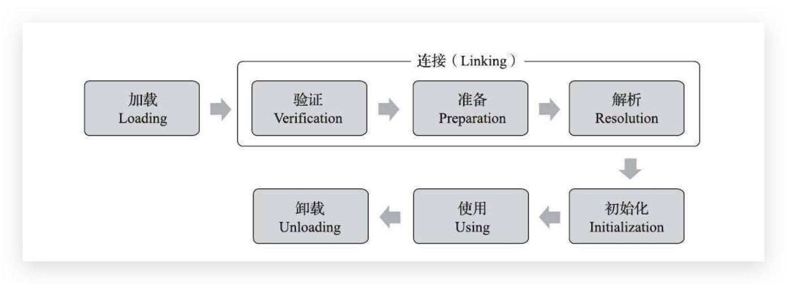

# 反射
通过反射机制，可以在运行时(区分编译时)访问Java对象的属性、方法、构造方法等。

## 反射简介
反射的应用场景：
- 通用框架的开发。最熟悉的`Spring`的`JavaBean`的配置化，根据配置文件加载不同的对象或类，运行时加载需要加载的对象。
- 动态代理。在`AOP`中，通过动态代理拦截特定方法。
- 注解。注解仅仅是标记，利用反射机制根据标记调用注解解释器。
- 可扩展功能。如`JDBC`驱动的加载。
- `IDE`自动提示和测试工具。

反射包括`Class`和`java.lang.reflect`，`java.lang.reflect `包中的类都没有 public 构造方法。核心接口和类如下：
- `Member `接口：反映关于单个成员(字段或方法)或构造函数的标识信息。
- `Field `类：提供一个类的域的信息以及访问类的域的接口。
- `Method` 类：提供一个类的方法的信息以及访问类的方法的接口。
- `Constructor` 类：提供一个类的构造函数的信息以及访问类的构造函数的接口。
- `Array `类：该类提供动态地生成和访问 JAVA 数组的方法。
- `Modifier` 类：提供了 static 方法和常量，对类和成员访问修饰符进行解码。
- `Proxy `类：提供动态地生成代理类和类实例的静态方法。

反射的缺点：
- 性能开销。涉及动态类型的解析，JVM无法对代码优化。
- 内部暴露。访问私有的属性和方法；破坏抽象性，平台变化-->代码行为的变化。
- 破坏封装。忽略权限检查。

## 反射机制
### 类加载过程
虚拟机把描述类的数据从Class文件加载到内存，并对数据进行校验、转换解析和初始化，最终形成可以被虚拟机直接使用的Java类型，这就是虚拟机的类加载机制。（运行期类加载------>Java动态扩展的语言特性）

关于类加载和类加载器的内容在后面适当时候再展开。
### 反射的基本运用
##### 获得Class对象
方法有三种：

(1) 使用 Class 类的 `forName` 静态方法:
```
public static Class<?> forName(String className)

比如在 JDBC 开发中常用此方法加载数据库驱动:
 Class.forName(driver);
```
(2)直接获取某一个对象的 class，比如:
```
Class<?> klass = int.class;
Class<?> classInt = Integer.TYPE;
```
(3)调用某个对象的 `getClass()`方法，比如:
```
StringBuilder str = new StringBuilder("123");
Class<?> klass = str.getClass();
```
##### 判断是否为某个类的实例
判断是否为某个类的实例有两种方式：
(1)用 `instanceof` 关键字
(2)用 Class 对象的 `isInstance` 方法（它是一个 Native 方法）

##### 创建实例
通过反射来生成对象主要有两种方式。

(1)使用Class对象的`newInstance()`方法来创建Class对象对应类的实例。
```
Class<?> c = String.class;
Object str = c.newInstance();
```
(2)先通过Class对象获取指定的Constructor对象，再调用Constructor对象的`newInstance()`方法来创建实例。这种方法可以用指定的构造器构造类的实例。
```
//获取String所对应的Class对象
Class<?> c = String.class;
//获取String类带一个String参数的构造器
Constructor constructor = c.getConstructor(String.class);
//根据构造器创建实例
Object obj = constructor.newInstance("23333");
System.out.println(obj);
```
##### Field
Class 对象提供以下方法获取对象的成员（Field）：

- ```getFiled``` - 根据名称获取公有的（public）类成员。
- ```getDeclaredField``` - 根据名称获取已声明的类成员。但不能得到其父类的类成员。
- ```getFields``` - 获取所有公有的（public）类成员。
- ```getDeclaredFields``` - 获取所有已声明的类成员。

##### Method
Class 对象提供以下方法获取对象的方法（Method）：

- ```getMethod``` - 返回类或接口的特定方法。其中第一个参数为方法名称，后面的参数为方法参数对应 Class 的对象。
- ```getDeclaredMethod``` - 返回类或接口的特定声明方法。其中第一个参数为方法名称，后面的参数为方法参数对应 Class 的对象。
- ```getMethods``` - 返回类或接口的所有 public 方法，包括其父类的 public 方法。
- ```getDeclaredMethods``` - 返回类或接口声明的所有方法，包括 public、protected、默认（包）访问和 private 方法，但不包括继承的方法。

获取一个 Method 对象后，可以用 invoke 方法来调用这个方法。
##### Constructor
Class 对象提供以下方法获取对象的构造方法（Constructor）：

- ```getConstructor``` - 返回类的特定 public 构造方法。参数为方法参数对应 Class 的对象。
- ```getDeclaredConstructor``` - 返回类的特定构造方法。参数为方法参数对应 Class 的对象。
- ```getConstructors``` - 返回类的所有 public 构造方法。
- ```getDeclaredConstructors``` - 返回类的所有构造方法。

获取一个 Constructor 对象后，可以用 newInstance 方法来创建类实例。
##### 绕开访问限制
有时候，我们需要通过反射访问私有成员、方法。可以使用 ```Constructor/Field/Method.setAccessible(true)``` 来绕开 Java 语言的访问限制。
##### 利用反射创建数组
数组在 Java 里是比较特殊的一种类型，它可以赋值给一个对象引用。Java 中，通过 ```Array.newInstance```创建数组的实例。
```
public class ReflectionArray {
    public static void main(String[] args) throws ClassNotFoundException {
        Class<?> cls = Class.forName("java.lang.String");
        Object array = Array.newInstance(cls, 25);

        //往数组里添加内容
        Array.set(array, 0, "Scala");
        Array.set(array, 1, "Java");
        Array.set(array, 2, "Groovy");
        Array.set(array, 3, "Scala");
        Array.set(array, 4, "Clojure");
        //获取某一项的内容
        System.out.println(Array.get(array, 3));
    }
}
```
```Array.newInstance```方法：
```

    /**
     * Creates a new array with the specified component type and
     * length.
     * Invoking this method is equivalent to creating an array
     * as follows:
     * <blockquote>
     * <pre>
     * int[] x = {length};
     * Array.newInstance(componentType, x);
     * </pre>
     * </blockquote>
     *
     * <p>The number of dimensions of the new array must not
     * exceed 255.
     *
     * @param componentType the {@code Class} object representing the
     * component type of the new array
     * @param length the length of the new array
     * @return the new array
     * @exception NullPointerException if the specified
     * {@code componentType} parameter is null
     * @exception IllegalArgumentException if componentType is {@link
     * Void#TYPE} or if the number of dimensions of the requested array
     * instance exceed 255.
     * @exception NegativeArraySizeException if the specified {@code length}
     * is negative
     */
    public static Object newInstance(Class<?> componentType, int length)
        throws NegativeArraySizeException {
        return newArray(componentType, length);
    }
```
而` newArray` 方法是一个 native 方法，它在 HotSpot JVM 里的具体实现我们后边再研究，这里先把源码贴出来。
```
private static native Object newArray(Class<?> componentType, int length)
        throws NegativeArraySizeException;
```

## invoke方法
方法的反射调用，也就是` Method.invoke `方法。
`Method.invoke` 方法源码：

```
    @CallerSensitive
    public Object invoke(Object obj, Object... args)
        throws IllegalAccessException, IllegalArgumentException,
           InvocationTargetException
    {
        if (!override) {
            if (!Reflection.quickCheckMemberAccess(clazz, modifiers)) {
                Class<?> caller = Reflection.getCallerClass();
                checkAccess(caller, clazz, obj, modifiers);
            }
        }
        MethodAccessor ma = methodAccessor;             // read volatile
        if (ma == null) {
            ma = acquireMethodAccessor();
        }
        return ma.invoke(obj, args);
    }
```
### 权限检查
invoke方法会首先检查`AccessibleObject`的`override`属性的值。`AccessibleObject` 类是 Field、Method 和 Constructor 对象的基类。它提供了将反射的对象标记为在使用时取消默认 Java 语言访问控制检查的能力。

override的值默认是false,表示需要权限调用规则，调用方法时需要检查权限;我们也可以用`setAccessible`方法设置为true,若override的值为true，表示忽略权限规则，调用方法时无需检查权限（也就是说可以调用任意的private方法，违反了封装）。

### invoke()调用
`Method.invoke()`实际上并不是自己实现的反射调用逻辑，而是委托给`sun.reflect.MethodAccessor`来处理。

`MethodAccessor`是一个接口，定义了invoke方法。分析其Usage可得它的具体实现类有:

- sun.reflect.DelegatingMethodAccessorImpl
- sun.reflect.MethodAccessorImpl
- sun.reflect.NativeMethodAccessorImpl
第一次调用一个Java方法对应的Method对象的invoke()方法之前，实现调用逻辑的`MethodAccessor`对象还没有创建；等第一次调用时才新创建`MethodAccessor`并更新给root，然后调用`MethodAccessor.invoke()`完成反射调用：
```
    // NOTE that there is no synchronization used here. It is correct
    // (though not efficient) to generate more than one MethodAccessor
    // for a given Method. However, avoiding synchronization will
    // probably make the implementation more scalable.
    private MethodAccessor acquireMethodAccessor() {
        // First check to see if one has been created yet, and take it
        // if so
        MethodAccessor tmp = null;
        if (root != null) tmp = root.getMethodAccessor();
        if (tmp != null) {
            methodAccessor = tmp;
        } else {
            // Otherwise fabricate one and propagate it up to the root
            tmp = reflectionFactory.newMethodAccessor(this);
            setMethodAccessor(tmp);
        }

        return tmp;
    }
```
`methodAccessor`实例由`reflectionFactory`对象操控生成:

```
public class ReflectionFactory {
    private static boolean initted = false;
    private static Permission reflectionFactoryAccessPerm
        = new RuntimePermission("reflectionFactoryAccess");
    private static ReflectionFactory soleInstance = new ReflectionFactory();
    // Provides access to package-private mechanisms in java.lang.reflect
    private static volatile LangReflectAccess langReflectAccess;
    // 这里设计得非常巧妙
    // "Inflation" mechanism. Loading bytecodes to implement
    // Method.invoke() and Constructor.newInstance() currently costs
    // 3-4x more than an invocation via native code for the first
    // invocation (though subsequent invocations have been benchmarked
    // to be over 20x faster). Unfortunately this cost increases
    // startup time for certain applications that use reflection
    // intensively (but only once per class) to bootstrap themselves.
    // To avoid this penalty we reuse the existing JVM entry points
    // for the first few invocations of Methods and Constructors and
    // then switch to the bytecode-based implementations.
    //
    // Package-private to be accessible to NativeMethodAccessorImpl
    // and NativeConstructorAccessorImpl
    private static boolean noInflation        = false;
    private static int     inflationThreshold = 15;
    //......
	//这是生成MethodAccessor的方法
    public MethodAccessor newMethodAccessor(Method method) {
        checkInitted();
        if (noInflation && !ReflectUtil.isVMAnonymousClass(method.getDeclaringClass())) {
            return new MethodAccessorGenerator().
                generateMethod(method.getDeclaringClass(),
                               method.getName(),
                               method.getParameterTypes(),
                               method.getReturnType(),
                               method.getExceptionTypes(),
                               method.getModifiers());
        } else {
            NativeMethodAccessorImpl acc =
                new NativeMethodAccessorImpl(method);
            DelegatingMethodAccessorImpl res =
                new DelegatingMethodAccessorImpl(acc);
            acc.setParent(res);
            return res;
        }
    }
    //......
    /** We have to defer full initialization of this class until after
    the static initializer is run since java.lang.reflect.Method's
    static initializer (more properly, that for
    java.lang.reflect.AccessibleObject) causes this class's to be
    run, before the system properties are set up. */
    private static void checkInitted() {
        if (initted) return;
        AccessController.doPrivileged(
            new PrivilegedAction<Void>() {
                public Void run() {
                    // Tests to ensure the system properties table is fully
                    // initialized. This is needed because reflection code is
                    // called very early in the initialization process (before
                    // command-line arguments have been parsed and therefore
                    // these user-settable properties installed.) We assume that
                    // if System.out is non-null then the System class has been
                    // fully initialized and that the bulk of the startup code
                    // has been run.
                    if (System.out == null) {
                        // java.lang.System not yet fully initialized
                        return null;
                    }
                    String val = System.getProperty("sun.reflect.noInflation");
                    if (val != null && val.equals("true")) {
                        noInflation = true;
                    }
                    val = System.getProperty("sun.reflect.inflationThreshold");
                    if (val != null) {
                        try {
                            inflationThreshold = Integer.parseInt(val);
                        } catch (NumberFormatException e) {
                            throw new RuntimeException("Unable to parse property sun.reflect.inflationThreshold", e);
                        }
                    }
                    initted = true;
                    return null;
                }
            });
    }
}
```
为什么反射调用`DelegatingMethodAccessorImpl `作为中间层，而不是直接交给本地实现？

其实，Java 的反射调用机制还设立了另一种动态生成字节码的实现（下称动态实现），直接使用 invoke 指令来调用目标方法。之所以采用委派实现，便是为了能够在本地实现以及动态实现中切换。动态实现和本地实现相比，其运行效率要快上 20 倍。这是因为动态实现无需经过 Java 到 C++ 再到 Java 的切换，但由于生成字节码十分耗时，仅调用一次的话，反而是本地实现要快上 3 到 4 倍。 所以第一次加载的时候我们会发现使用的是 `NativeMethodAccessorImpl` 的实现，而当反射调用次数超过 15 次之后，则使用 `MethodAccessorGenerator` 生成的 `MethodAccessorImpl` 对象去实现反射。 

考虑到许多反射调用仅会执行一次，Java 虚拟机设置了一个阈值 15（可以通过 -`Dsun.reflect.inflationThreshold` 来调整），当某个反射调用的调用次数在 15 之下时，采用本地实现；当达到 15 时，便开始动态生成字节码，并将委派实现的委派对象切换至动态实现，这个过程我们称之为 Inflation。

示例：以`-Dfile.encoding=UTF-8 -verbose:class`启动
```
package com.aaachuan.reflection;

import java.lang.reflect.Method;

public class MethodInvoke {
    public static void target(int i) {
        new Exception("#" + i).printStackTrace();
    }

    public static void main(String[] args) throws Exception {
        Class<?> klass = Class.forName("com.aaachuan.reflection.MethodInvoke");
        Method method = klass.getMethod("target", int.class);
        for (int i = 0; i < 20; i++) {
            method.invoke(null, i);
        }
    }
}
```
其中输出内容：
```
java.lang.Exception: #15
	at com.aaachuan.reflection.MethodInvoke.target(MethodInvoke.java:7)
	at sun.reflect.NativeMethodAccessorImpl.invoke0(Native Method)
	at sun.reflect.NativeMethodAccessorImpl.invoke(NativeMethodAccessorImpl.java:62)
	at sun.reflect.DelegatingMethodAccessorImpl.invoke(DelegatingMethodAccessorImpl.java:43)
	at java.lang.reflect.Method.invoke(Method.java:498)
	at com.aaachuan.reflection.MethodInvoke.main(MethodInvoke.java:14)
java.lang.Exception: #16
	at com.aaachuan.reflection.MethodInvoke.target(MethodInvoke.java:7)
	at sun.reflect.GeneratedMethodAccessor1.invoke(Unknown Source)
	at sun.reflect.DelegatingMethodAccessorImpl.invoke(DelegatingMethodAccessorImpl.java:43)
	at java.lang.reflect.Method.invoke(Method.java:498)
	at com.aaachuan.reflection.MethodInvoke.main(MethodInvoke.java:14)
```
可以看到，从第 16 次开始后，都是使用 `DelegatingMethodAccessorImpl `，不再使用本地实现 `NativeMethodAccessorImpl`。

[反射调用的性能开销](https://dunwu.github.io/javacore/basics/java-reflection.html#_2-4-%E5%8F%8D%E5%B0%84%E8%B0%83%E7%94%A8%E7%9A%84%E5%BC%80%E9%94%80)

[深入解析Java反射（2） - invoke方法](https://www.sczyh30.com/posts/Java/java-reflection-2/)